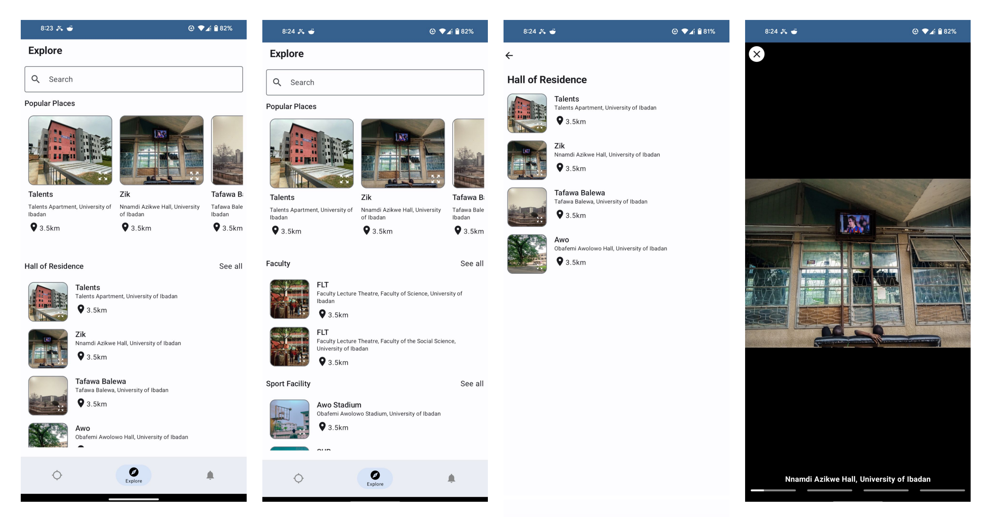
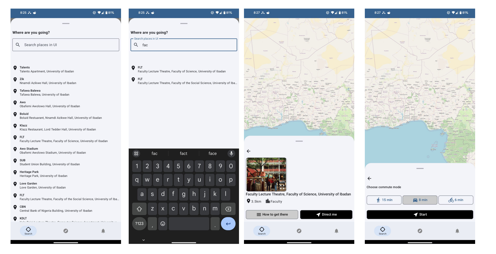
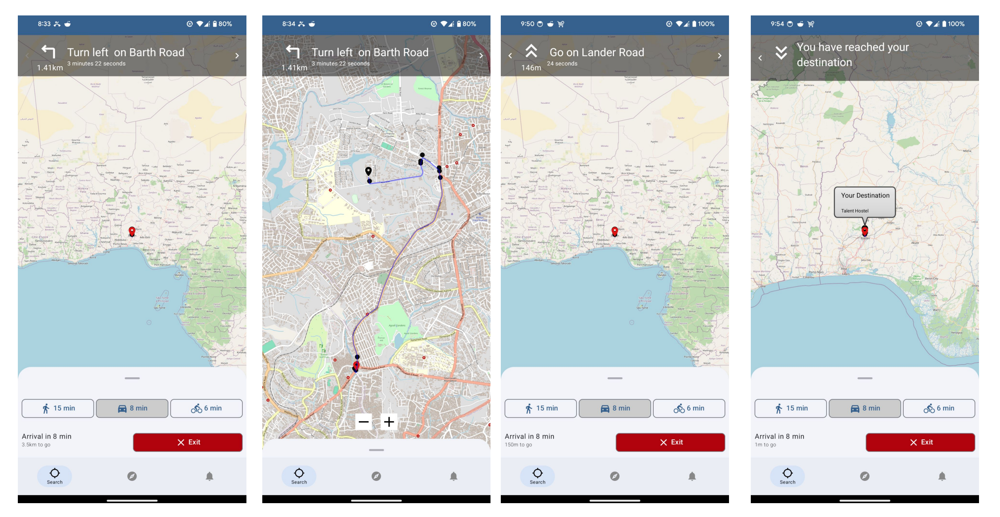

# Campus Navigator
Hey there! 👋🏼👋🏼👋🏼

This is an android application that aids navigation from one place to another within the University of Ibadan.
It uses data from OpenStreetMap(OSM) to display maps, routes and directions and makes API request to this [server](https://github.com/Sir-Dave/Location-Navigator-Backend).

### Features
- Retrieves user current location.
- Allows search for locations including their aliases.
- Estimates time and distance between 2 locations.
- Step-by-step direction for transportation modes (walking, cycling or driving).
- Offline support.

### Tools and Libraries
- Jetpack Compose
- Clean Architecture & MVVM
- Asynchronous operations using Kotlin Coroutines and Flows
- Database and caching using Room
- Dependency Injection using Hilt
- API requests to server via Retrofit
- OpenStreetMap (OSMAndroid)

### Prerequisite
To build this project, you require:

- Android Studio Canary version and up
- Gradle 7.4.2
- Kotlin 1.8.0
- Compose 1.2.0

#### App Screenshots
  

  

  